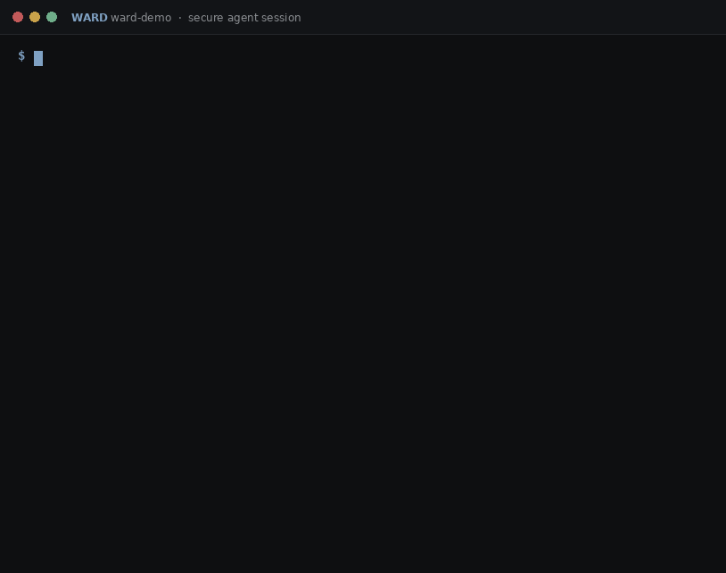

<p align="center">
  
</p>

<h1 align="center">WardOS</h1>

<p align="center"><strong>A secure Linux workstation for software engineers working with autonomous coding agents.</strong></p>

WardOS is a purpose-built Linux distribution for agentic software development. It gives
coding agents (Claude Code, Codex, Gemini CLI, Aider, and whatever comes next) everything
they need to work effectively, while keeping the host, policy, credentials, verifier, and
trusted state **outside the agent's authority**.


<p align="center"><sub>Rendered from the shipped configs, theme tokens and real command output (<a href="assets/storyboard/">how</a>); a compositor capture is <a href="https://github.com/hexrift/WardOS/issues/84">#84</a>.</sub></p>

```bash
ward init            # policy, verifier config and TamperWard wiring for this directory
ward claude          # Claude Code in the sandbox; keys stay on the host
ward verify          # the protected tests, in a disposable verifier, from the entry snapshot
```

## Get started

On a Linux you already have, install the release binaries: the tarball for your
architecture and its checksum from the
[latest release](https://github.com/hexrift/WardOS/releases/latest)
(`wardos-<version>-<arch>-linux.tar.gz` and `.sha256`; `<arch>` is `uname -m`, x86_64
or aarch64), checked before anything is unpacked:

```bash
sha256sum -c wardos-0.2.0-x86_64-linux.tar.gz.sha256      # the checksum from the same release
tar -xzf wardos-0.2.0-x86_64-linux.tar.gz
cp wardos-0.2.0-x86_64-linux/{ward,wardd,ward-agent} ~/.local/bin/
```

On a machine of its own, boot the image ([`image/README.md`](image/README.md)): the
agents, TamperWard and the desktop are in it, and the first login walks you through a
theme, a key, a project and an agent. The convenient development installer,
`curl -fsSL https://raw.githubusercontent.com/hexrift/WardOS/main/install.sh | bash`,
does the three steps above for you and runs `ward doctor`; it is a shell script fetched
from `main`, so read it first ([`docs/install.md`](docs/install.md)).

Then, in any project, five commands and about five minutes
([`docs/onboarding.md`](docs/onboarding.md)):

```bash
ward doctor                        # what this host can give a session, with a fix per gap
ward vault set ANTHROPIC_API_KEY   # the model key, typed without echo, kept on the host
ward init                          # policy, verifier config, TamperWard wiring; never overwrites yours
ward claude                        # Claude Code in the sandbox; the proxy injects the key
ward verify                        # the protected tests, from the entry snapshot, offline
```

## See it running



The prototype runs today on any Linux host with `bubblewrap`. It merges the project's
policy into a capability manifest, freezes a content-addressed entry snapshot, runs
commands inside an isolated sandbox with live kernel-origin file events, routes every
network request through a per-session policy proxy, and records everything to an
append-only, hash-chained event log that persists across commands.


Claude Code runs inside that sandbox unmodified. The model-API key stays on the host:
the agent gets a placeholder and a base URL on the session proxy, which injects the real
key on the way out (`CRED`). Its hooks report to `wardd` (`NOTE`, `TOOL`), and every
request to `api.anthropic.com` is a `NET` row. Below, a deliberately invalid host key:
the API's `401` is the proof that the request left through the gateway and nothing else.


The verifier guards the judge, not the implementation. `ward verify` snapshots the
worktree as a candidate, takes every protected test and the verify config from the
*entry* snapshot, and runs the suite offline in a disposable sandbox. Below, the demo's
bug fails; the shortcut of gutting the protected security test changes nothing, because
the verifier restores the pristine copy; the real one-line fix passes.


Each session's log has one writer. `ward up` starts a per-session `wardd` that owns the
hash chain behind a control socket; every `ward` command writes through it, TamperWard
appends its decisions as `origin=tamperward` evidence, and `ward watch` follows the log
live from another terminal, as a full-screen observer (trust bar, activity stream,
counters) or as plain rows on a pipe. Without a daemon, every command still works in-process.


```bash
# the binaries: the release tarball (Get started), install.sh, or cargo build --release
ward doctor                         # what this host can give a session, with a fix per gap
ward up       examples/ward-demo    # start a session: policy → manifest, entry snapshot, log
ward run --dir examples/ward-demo -- cargo test   # run inside the sandbox; live observer
ward claude   examples/ward-demo    # launch Claude Code; ANTHROPIC_API_KEY stays on the host
ward claude   examples/ward-demo --grant github   # …and git/API calls to GitHub through the proxy
ward status   examples/ward-demo    # the security panel for the active session
ward verify   examples/ward-demo    # trusted verifier: protected tests from the entry snapshot
ward selftest examples/ward-demo    # prove the isolation (29 hostile probes; none reaches its target)
ward pause    examples/ward-demo    # freeze the agents as one operation: processes, network, credentials, approvals (--reason, --status)
ward resume   examples/ward-demo    # let them continue
ward stop     examples/ward-demo    # seal the log (from paused: the frozen processes end, the workspace stays)
ward stop     examples/ward-demo --restore-entry   # …after writing the entry snapshot back over the worktree (.ward/restore-<ts>/ keeps what it replaced)
ward replay   <events.log>          # replay any sealed session (--verify, --json)
ward session describe examples/ward-demo   # the session's immutable facts for TamperWard (--json)
ward session pending  examples/ward-demo   # held approvals: destination · requested by agent · Ward will allow (--json)
ward session grants   examples/ward-demo   # the temporary authority the agent holds: allow-session answers, --grant credentials (--json)
ward snapshot create  examples/ward-demo   # capture the worktree into the CAS (--role candidate|final)
ward snapshot diff    <a> <b>              # manifest-level diff from the CAS, not the worktree (--json)
ward snapshot cat     <id> <path>          # pristine bytes of a path in a snapshot
ward watch            examples/ward-demo   # full-screen observer on a terminal (--tui; q quits), one row per line on a pipe or with --plain (--from <seq>, --all)
ward evidence append  examples/ward-demo --json '{"TamperDetected":{"subject":"VerifyConfig","detail":".tamperward/config.yml"}}'
                                           # append a TamperWard-origin record through the daemon (--json - reads stdin)
```

In the session above the sandbox's only way out is a Unix socket to the session proxy:
an allowlisted registry is reached over real HTTPS (`NET`, `http 200`), while a private
address and the cloud metadata endpoint are refused host-side (`DENY`, `403`). The host
home, SSH keys, cloud credentials, Docker socket, and the namespace, cgroup and symlink
escape routes are never reachable, so `ward selftest` shows every probe denied by
construction, and CI reproduces the same result on every pull request.

## Design principle

> Give coding agents everything they need to work effectively, while keeping the host,
> policy, credentials, verifier, and trusted state outside their authority.

WardOS provides **isolation and trustworthy primitives**. TamperWard provides **policy,
protected invariants, tamper detection, independent verification, and evidence**. The two
are designed together but do not duplicate each other:

```text
WardOS policy      = capabilities and isolation   (what the agent CAN reach)
TamperWard policy  = allowed behaviour and verification (what the agent MAY do, and whether
                     the result is acceptable)
```

## Status

**Phase 7 — authority, freshness, intervention.** The phase is declared once, in
[`docs/status.toml`](docs/status.toml), and CI fails any document that claims one of
its own. The contract is [ADR-0019](docs/decisions/ADR-0019-authority-freshness-intervention.md):
the architecture and the visual language stay, what changes is what a human can read
from the desktop at a glance. In progress:

* **Verification bound to a snapshot, with its freshness shown.** `VERIFY` has five
  states (`—`, `◐`, `✓ 7c01…`, `~ STALE`, `✗`); green disappears the moment the
  worktree differs from the verified candidate, decided by content, not heuristics.
  Built: the shell digests the worktree before every bar frame and `ward-shell
  verify-panel` (the segment's click) shows the candidate, the digest and what differs.
* **Approvals that separate the agent's claim from Ward's authority.** The destination,
  *requested by agent* (verbatim, labelled as the agent's words) and *Ward will allow*
  (what the policy and credential rules actually grant) as three blocks.
* **Pause as a host primitive.** `ward pause` and one key freeze the session, close the
  proxy, suspend credential injection and hold approvals as one recorded operation;
  the exits are resume, stop keeping the workspace, stop restoring the entry state.
* **Temporary authority visible while it exists.** A session-scoped grant changes the
  bar (`NET restricted · github+`, `GRANTS 1`) until the session ends.
* **Approval load as a security metric.** E-13 (approvals per agent-hour, approve and
  deny rates, decision time, and the rest) and E-14 (ten to twenty real tasks, bare
  agent against WardOS, ending with four comprehension questions); no targets until
  the data exists ([`docs/experiments.md`](docs/experiments.md)).
* **The remaining security proofs before more desktop polish**: ST-029 a hostile
  verifier corpus ([`docs/security-model.md`](docs/security-model.md) §6). Delivered:
  ST-018 freeze before capture (the daemon freezes the sandbox for the length of a
  candidate/final capture so no agent write interleaves with it, an integration test
  reproduced by CI); ST-022 TLS interception, ST-026 raw TCP, SOCKS and UDP, ST-027
  loopback and control surfaces, ST-028 DNS rebinding and pinning, as the
  `egress and surfaces` group of `ward selftest` (thirteen rows, §6.1).
* **One install path and one status.** The release tarball with its checksum is the
  primary install; signed releases wait for a signing-key decision
  ([`docs/roadmap.md`](docs/roadmap.md)).

Delivered. The v0.2.0 release ships the five host binaries with the bootable disks
attached; `ghcr.io/hexrift/wardos:latest` is rebuilt, linted and published on every
merge, for x86_64 and aarch64, and an installed host follows it on a timer with
rollback. What the image holds today:

* **The secure-session layer.** `ward up` / `run` / `claude` / `codex` / `stop` /
  `verify` / `replay --verify` on a capability manifest, content-addressed entry
  snapshots and a hash-chained log; a per-session `wardd` as the single log writer; a
  per-session policy proxy that is the sandbox's only way out, injecting the model-API
  and GitHub credentials on repo-scoped routes so no key ever enters the sandbox; Claude
  Code hooks reporting to `wardd`, `ask` decisions held by the daemon until the desktop
  answers; `ward pause` / `ward resume`, the host's own hold on a session as one
  recorded operation (processes frozen, proxy closed, credentials suspended, approvals
  held), with `ward stop --restore-entry` to leave as you came; `ward verify`, a
  disposable offline verifier that takes the protected tests and its config from the
  entry snapshot; 29 hostile probes in `ward selftest`, every one denied where the host
  can run it (a probe the host cannot run, such as the IPv6 path on a kernel without
  IPv6, says `CANNOT-MEASURE-HERE` and never counts as a pass), reproduced by CI on every
  pull request; a daemon-backed warm start of 32 ms.
* **The agents.** Claude Code, OpenAI Codex and TamperWard at pinned versions with a
  lockfile, installed at build time, read-only in the sandbox; `ward init` makes any
  directory a project (policy, verifier config, TamperWard wiring, idempotent);
  `ward vault` keeps keys on the host; `ward doctor` reports agents, keys, firewall and
  kernel features with a fix for each gap.
* **The desktop** ([ADR-0016](docs/decisions/ADR-0016-desktop-feature-set.md),
  [`docs/desktop.md`](docs/desktop.md)): Hyprland 0.56 with the full key set, the trust
  bar in Waybar (its `VERIFY ✓` turns `~ STALE` the moment the worktree differs from
  the verified candidate), the command centre and every menu in fuzzel, approvals as
  notifications that show the destination, the agent's claim labelled as its own and
  what Ward will allow (ADR-0019), answered with `y`/`s`/`n`, `Super + Shift + P` to
  pause the agents with the exits in a menu, every temporary grant on the bar while it
  lasts, fourteen themes rendered into every component
  with a wallpaper drawn from each theme's tokens, a lock screen, the `wardos-*` command
  family for capture, power, web apps, terminal apps, installs and setup, and
  `wardos-welcome` for the first login. CI parses the Hyprland tree with the compositor
  the image ships, so a renamed option fails a pull request instead of a boot.
* **Security posture.** LUKS by default on the installer ISO, a firewall that admits
  nothing inbound, timed image updates, no compiler on the host (a Rust toolchain for
  `ward verify` lives in the user's home, `wardos-install dev rust`), one browser,
  every package name checked against Fedora 44 before the image is built, and nothing
  in the image is fetched by `curl | sh` at build time.
* **Agent-first onboarding** ([ADR-0017](docs/decisions/ADR-0017-agent-first-image.md)):
  `wardos-welcome` walks the first login through theme, key, project and agent;
  `ward init`, `ward vault` and `ward doctor` are the same path on any Linux; the
  image boots to the desktop in QEMU on a Fedora laptop (E-09, first boot; the
  Hyprland config errors it showed are fixed and now caught by CI).

Still ahead, behind the list above: the onboarding walk on real hardware with the time
from boot to `✓ VERIFIED`, the semantic TamperWard rules, the verifier image, the
shell's own toolkit (E-10), and the Secure Boot chain.

See [`docs/roadmap.md`](docs/roadmap.md) for the phase plan and
[`docs/experiments.md`](docs/experiments.md) for the recorded results of the experiments
that gate each phase.

## Documentation

| Document | Purpose |
| --- | --- |
| [`docs/architecture.md`](docs/architecture.md) | Components, trust zones, session lifecycle, data flows |
| [`docs/threat-model.md`](docs/threat-model.md) | Assets, adversaries, attack surfaces, mitigations, explicit non-goals |
| [`docs/security-model.md`](docs/security-model.md) | Guarantees WardOS makes, guarantees it does not make, capability model, defaults |
| [`docs/snapshots-and-git.md`](docs/snapshots-and-git.md) | Frozen entry state, candidate state, and why `.git` is not trusted |
| [`docs/event-model.md`](docs/event-model.md) | The typed Ward event model, evidence chain, observer and replay |
| [`docs/credential-broker.md`](docs/credential-broker.md) | How agents obtain scoped, short-lived credentials without seeing long-lived secrets |
| [`docs/tamperward-integration.md`](docs/tamperward-integration.md) | The OS-level primitives WardOS exposes to TamperWard |
| [`docs/onboarding.md`](docs/onboarding.md) | Five minutes to a verified agent: boot, welcome, key, project, `ward claude`, `ward verify`, what the bar shows, what to do when something is denied |
| [`docs/install.md`](docs/install.md) | Install on an existing Linux host, requirements, first project and session |
| [`docs/agent-integration.md`](docs/agent-integration.md) | How `ward claude` / `ward codex` compose the sandbox, proxy, credentials and hooks |
| [`docs/design-language.md`](docs/design-language.md) | Visual and interaction identity of the WardOS desktop |
| [`docs/desktop.md`](docs/desktop.md) | The desktop: commands, keys, menu, themes, packages, parity with Omarchy |
| [`docs/performance.md`](docs/performance.md) | Latency budgets, benchmark methodology, CI regression gates |
| [`docs/experiments.md`](docs/experiments.md) | Highest-risk assumptions and the experiments that must settle them |
| [`docs/roadmap.md`](docs/roadmap.md) | Phases, first-prototype scope, acceptance criteria, implementation sequence |
| [`docs/repository-structure.md`](docs/repository-structure.md) | Proposed layout of this repository |
| [`docs/decisions/`](docs/decisions/) | Architecture Decision Records for every major technology choice |

## Engineering principles

1. Architecture over micro-optimisation.
2. Isolation over detection, where OS enforcement is appropriate.
3. Independent verification over trusting agent reports.
4. Fail closed for security decisions.
5. No invisible privilege escalation.
6. Performance must be measured.
7. Security claims must be testable.
8. The user should not need to understand the machinery.
9. Use existing Linux primitives before inventing replacements.
10. Do not optimise the benchmark by weakening the product.

## Non-goals

WardOS 0.1 is not a general-purpose desktop, a server OS, a Kubernetes distribution, a
gaming distro, a custom kernel project, a universal-hardware project, a promise of perfect
sandbox security, or an enterprise management platform. See
[`docs/roadmap.md`](docs/roadmap.md#non-goals).


## Contributing

See [`CONTRIBUTING.md`](CONTRIBUTING.md) for how to build, verify and propose a change,
and [`SECURITY.md`](SECURITY.md) for how to report a vulnerability.

## License

[Apache-2.0](LICENSE).
