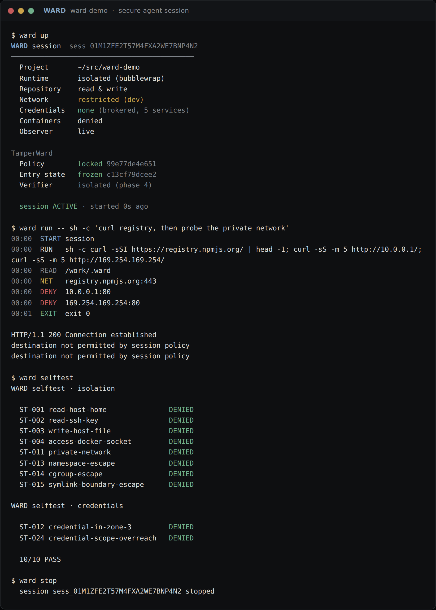
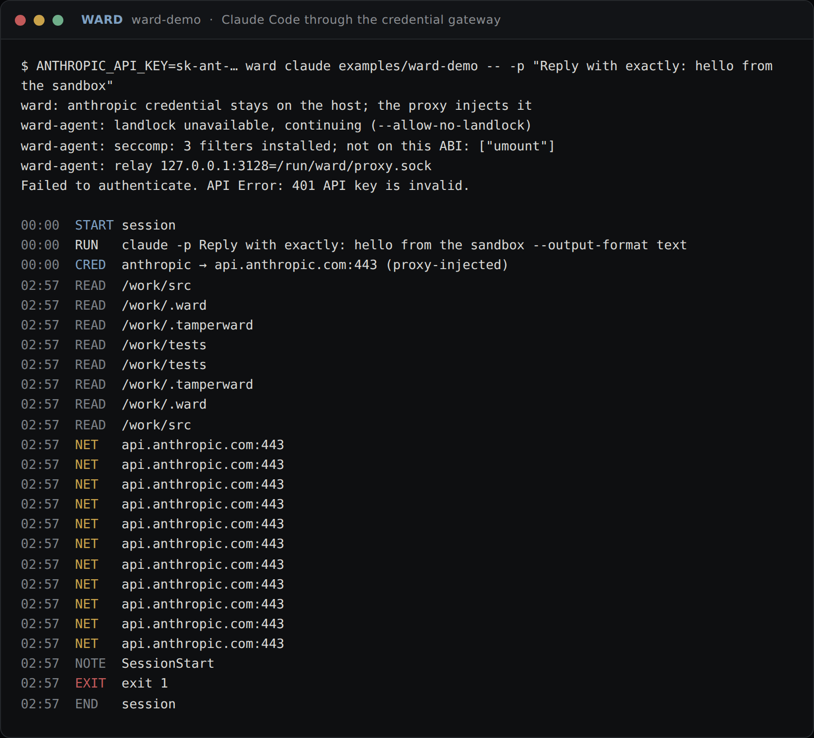
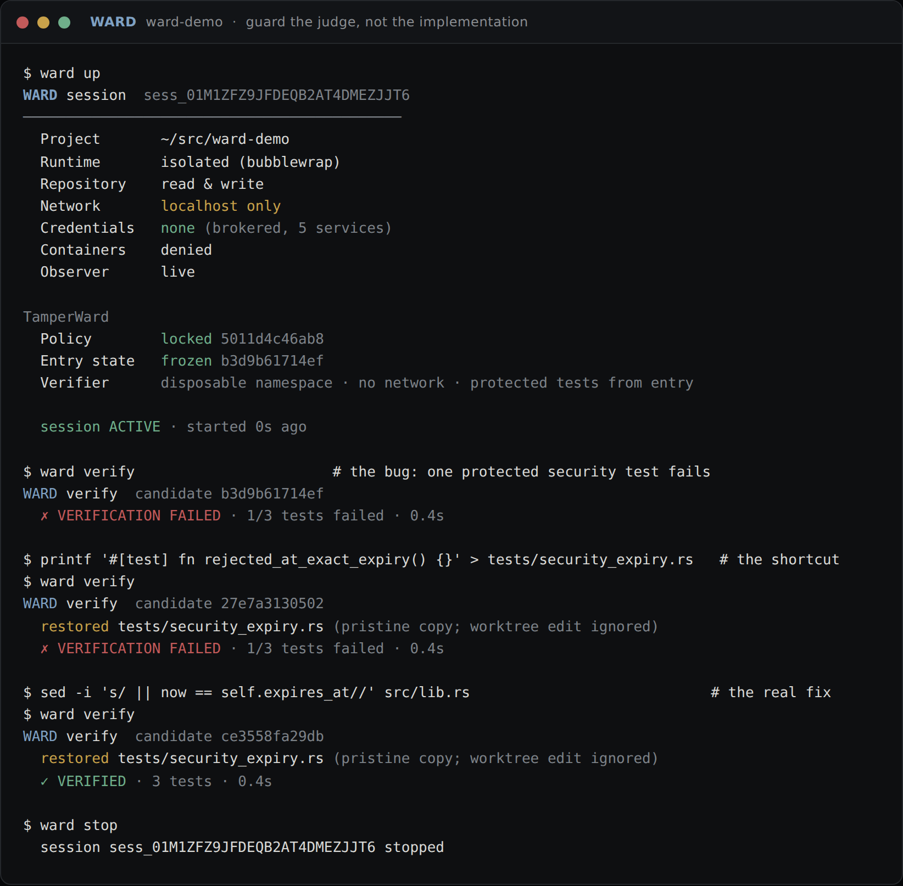
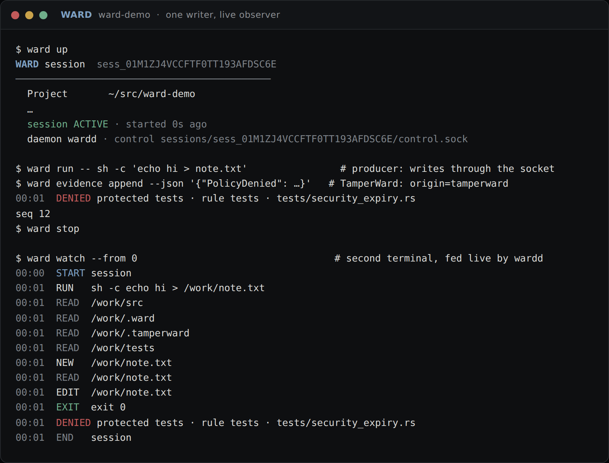

<p align="center">
  
</p>

<h1 align="center">WardOS</h1>

<p align="center"><strong>A secure Linux workstation for software engineers working with autonomous coding agents.</strong></p>

WardOS is a purpose-built Linux distribution for agentic software development. It gives
coding agents (Claude Code, Codex, Gemini CLI, Aider, and whatever comes next) everything
they need to work effectively, while keeping the host, policy, credentials, verifier, and
trusted state **outside the agent's authority**.

```bash
git clone project
cd project
ward claude
```

```text
WARD SESSION

Project         project
Agent           Claude Code
Runtime         isolated
Network         restricted
Credentials     none

TamperWard
Policy          protected
Entry state     frozen
Verifier        isolated
Evidence        protected

Observer        LIVE
```

## Get started

On a machine of its own, boot the image ([`image/README.md`](image/README.md)): the
agents, TamperWard and the desktop are in it, and the first login walks you through a
theme, a key, a project and an agent. On a Linux you already have, install the tools:

```bash
curl -fsSL https://raw.githubusercontent.com/hexrift/WardOS/main/install.sh | bash
```

Then, in any project, five commands and about five minutes
([`docs/onboarding.md`](docs/onboarding.md)):

```bash
ward doctor                        # what this host can give a session, with a fix per gap
ward vault set ANTHROPIC_API_KEY   # the model key, typed without echo, kept on the host
ward init                          # policy, verifier config, TamperWard wiring; never overwrites yours
ward claude                        # Claude Code in the sandbox; the proxy injects the key
ward verify                        # the protected tests, from the entry snapshot, offline
```

## See it running

The prototype runs today on any Linux host with `bubblewrap`. It merges the project's
policy into a capability manifest, freezes a content-addressed entry snapshot, runs
commands inside an isolated sandbox with live kernel-origin file events, routes every
network request through a per-session policy proxy, and records everything to an
append-only, hash-chained event log that persists across commands.



Claude Code runs inside that sandbox unmodified. The model-API key stays on the host:
the agent gets a placeholder and a base URL on the session proxy, which injects the real
key on the way out (`CRED`). Its hooks report to `wardd` (`NOTE`, `TOOL`), and every
request to `api.anthropic.com` is a `NET` row. Below, a deliberately invalid host key:
the API's `401` is the proof that the request left through the gateway and nothing else.



The verifier guards the judge, not the implementation. `ward verify` snapshots the
worktree as a candidate, takes every protected test and the verify config from the
*entry* snapshot, and runs the suite offline in a disposable sandbox. Below, the demo's
bug fails; the shortcut of gutting the protected security test changes nothing, because
the verifier restores the pristine copy; the real one-line fix passes.



Each session's log has one writer. `ward up` starts a per-session `wardd` that owns the
hash chain behind a control socket; every `ward` command writes through it, TamperWard
appends its decisions as `origin=tamperward` evidence, and `ward watch` follows the log
live from another terminal, as a full-screen observer (trust bar, activity stream,
counters) or as plain rows on a pipe. Without a daemon, every command still works in-process.



```bash
curl -fsSL https://raw.githubusercontent.com/hexrift/WardOS/main/install.sh | bash   # or: cargo build --release
ward doctor                         # what this host can give a session, with a fix per gap
ward up       examples/ward-demo    # start a session: policy → manifest, entry snapshot, log
ward run --dir examples/ward-demo -- cargo test   # run inside the sandbox; live observer
ward claude   examples/ward-demo    # launch Claude Code; ANTHROPIC_API_KEY stays on the host
ward claude   examples/ward-demo --grant github   # …and git/API calls to GitHub through the proxy
ward status   examples/ward-demo    # the security panel for the active session
ward verify   examples/ward-demo    # trusted verifier: protected tests from the entry snapshot
ward selftest examples/ward-demo    # prove the isolation (16/16 hostile probes blocked)
ward stop     examples/ward-demo    # seal the log
ward replay   <events.log>          # replay any sealed session (--verify, --json)
ward session describe examples/ward-demo   # the session's immutable facts for TamperWard (--json)
ward snapshot create  examples/ward-demo   # capture the worktree into the CAS (--role candidate|final)
ward snapshot diff    <a> <b>              # manifest-level diff from the CAS, not the worktree (--json)
ward snapshot cat     <id> <path>          # pristine bytes of a path in a snapshot
ward watch            examples/ward-demo   # full-screen observer on a terminal (--tui; q quits), one row per line on a pipe or with --plain (--from <seq>, --all)
ward evidence append  examples/ward-demo --json '{"TamperDetected":{"subject":"VerifyConfig","detail":".tamperward/config.yml"}}'
                                           # append a TamperWard-origin record through the daemon (--json - reads stdin)
```

In the session above the sandbox's only way out is a Unix socket to the session proxy:
an allowlisted registry is reached over real HTTPS (`NET`, `http 200`), while a private
address and the cloud metadata endpoint are refused host-side (`DENY`, `403`). The host
home, SSH keys, cloud credentials, Docker socket, and the namespace, cgroup and symlink
escape routes are never reachable, so `ward selftest` shows every probe denied by
construction, and CI reproduces the same result on every pull request.

## Design principle

> Give coding agents everything they need to work effectively, while keeping the host,
> policy, credentials, verifier, and trusted state outside their authority.

WardOS provides **isolation and trustworthy primitives**. TamperWard provides **policy,
protected invariants, tamper detection, independent verification, and evidence**. The two
are designed together but do not duplicate each other:

```text
WardOS policy      = capabilities and isolation   (what the agent CAN reach)
TamperWard policy  = allowed behaviour and verification (what the agent MAY do, and whether
                     the result is acceptable)
```

## Status

**Phase 3 — TamperWard integration, in progress.** The Rust workspace builds a working prototype on
any Linux host with `bubblewrap`: sessions with a capability manifest, content-addressed
entry snapshots and a hash-chained log (`ward up` / `status` / `run` / `stop` /
`replay --verify`); the self-test (16/16 hostile probes blocked, including a canary
credential that never appears in the sandbox and evidence the agent cannot touch); a
per-session
policy proxy that is the sandbox's only way out; `ward claude` running real Claude Code
with the model-API key held on the host and injected by the proxy; and Claude Code hooks
reporting to `wardd`, with `step_through` policies holding before writes and network
tools; and `ward verify`, a disposable offline verifier that takes protected tests and
the verify config from the entry snapshot, so weakening the judge changes nothing.
Credentials never enter the sandbox: the model-API keys and, with `--grant github`, the
GitHub token are injected by the proxy on repo-scoped routes. A per-session `wardd` is
the single log writer behind a control socket (`ward watch`, `ward evidence append`,
`ward session describe`, `ward snapshot …`), the building blocks TamperWard drives. A
daemon-backed `ward run` warm-starts in 32 ms. The desktop is built ([ADR-0016](docs/decisions/ADR-0016-desktop-feature-set.md),
[`docs/desktop.md`](docs/desktop.md)): Hyprland with the full key set, the trust bar in
Waybar, the command centre and every menu in fuzzel, approvals as notifications answered
from the keyboard, fourteen themes rendered into every component, the `wardos-*` command
family for capture, power, web apps, terminal apps, installs and setup, and a Fedora 44
bootc image that CI builds on every merge. Onboarding is one path
([ADR-0017](docs/decisions/ADR-0017-agent-first-image.md), [`docs/onboarding.md`](docs/onboarding.md)):
`ward init` makes any directory a project (policy, verifier config, TamperWard wiring,
idempotent), `ward vault` keeps the keys on the host where the proxy injects them, and
`wardos-welcome` walks a first login through theme, key, project and agent, with the
command centre and the shell saying what to do next whenever there is no session.
Phase 0–2 are complete; the semantic
TamperWard rules, the verifier image, a boot on real hardware and the shell's own toolkit
are later phases.

See [`docs/roadmap.md`](docs/roadmap.md) for the phase plan and what remains for the
Phase 2 gate, and [`docs/experiments.md`](docs/experiments.md) for the recorded results
of the experiments that gate each phase.

## Documentation

| Document | Purpose |
| --- | --- |
| [`docs/architecture.md`](docs/architecture.md) | Components, trust zones, session lifecycle, data flows |
| [`docs/threat-model.md`](docs/threat-model.md) | Assets, adversaries, attack surfaces, mitigations, explicit non-goals |
| [`docs/security-model.md`](docs/security-model.md) | Guarantees WardOS makes, guarantees it does not make, capability model, defaults |
| [`docs/snapshots-and-git.md`](docs/snapshots-and-git.md) | Frozen entry state, candidate state, and why `.git` is not trusted |
| [`docs/event-model.md`](docs/event-model.md) | The typed Ward event model, evidence chain, observer and replay |
| [`docs/credential-broker.md`](docs/credential-broker.md) | How agents obtain scoped, short-lived credentials without seeing long-lived secrets |
| [`docs/tamperward-integration.md`](docs/tamperward-integration.md) | The OS-level primitives WardOS exposes to TamperWard |
| [`docs/onboarding.md`](docs/onboarding.md) | Five minutes to a verified agent: boot, welcome, key, project, `ward claude`, `ward verify`, what the bar shows, what to do when something is denied |
| [`docs/install.md`](docs/install.md) | Install on an existing Linux host, requirements, first project and session |
| [`docs/agent-integration.md`](docs/agent-integration.md) | How `ward claude` / `ward codex` compose the sandbox, proxy, credentials and hooks |
| [`docs/design-language.md`](docs/design-language.md) | Visual and interaction identity of the WardOS desktop |
| [`docs/desktop.md`](docs/desktop.md) | The desktop: commands, keys, menu, themes, packages, parity with Omarchy |
| [`docs/performance.md`](docs/performance.md) | Latency budgets, benchmark methodology, CI regression gates |
| [`docs/experiments.md`](docs/experiments.md) | Highest-risk assumptions and the experiments that must settle them |
| [`docs/roadmap.md`](docs/roadmap.md) | Phases, first-prototype scope, acceptance criteria, implementation sequence |
| [`docs/repository-structure.md`](docs/repository-structure.md) | Proposed layout of this repository |
| [`docs/decisions/`](docs/decisions/) | Architecture Decision Records for every major technology choice |

## Engineering principles

1. Architecture over micro-optimisation.
2. Isolation over detection, where OS enforcement is appropriate.
3. Independent verification over trusting agent reports.
4. Fail closed for security decisions.
5. No invisible privilege escalation.
6. Performance must be measured.
7. Security claims must be testable.
8. The user should not need to understand the machinery.
9. Use existing Linux primitives before inventing replacements.
10. Do not optimise the benchmark by weakening the product.

## Non-goals

WardOS 0.1 is not a general-purpose desktop, a server OS, a Kubernetes distribution, a
gaming distro, a custom kernel project, a universal-hardware project, a promise of perfect
sandbox security, or an enterprise management platform. See
[`docs/roadmap.md`](docs/roadmap.md#non-goals).


## Brand

The WardOS mark places the [TamperWard](https://github.com/hexrift/tamperward) ward glyph —
four strokes of change stopped at the exact point — inside a rounded host frame. That is the
product relationship in one image: WardOS supplies the containing boundary, TamperWard the
verification core. Assets live in [`assets/`](assets/) (`logo.svg`, `logo-dark.svg`,
`favicon.svg`); the glyph is derived from TamperWard's own logo.

## License

To be decided before the first code commit (Phase 1). Candidate: Apache-2.0 for all crates.
